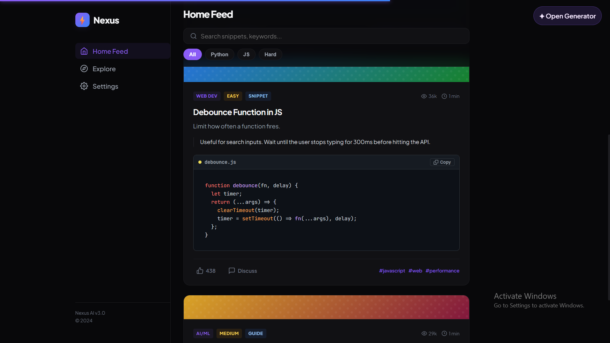
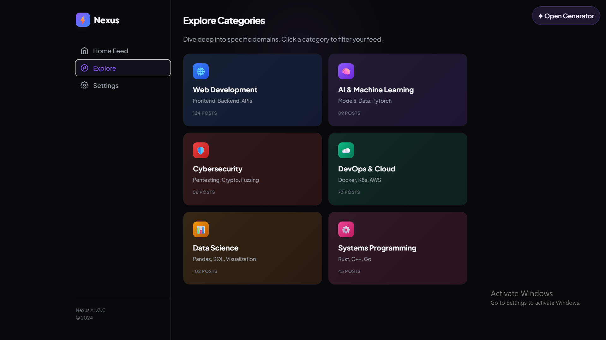
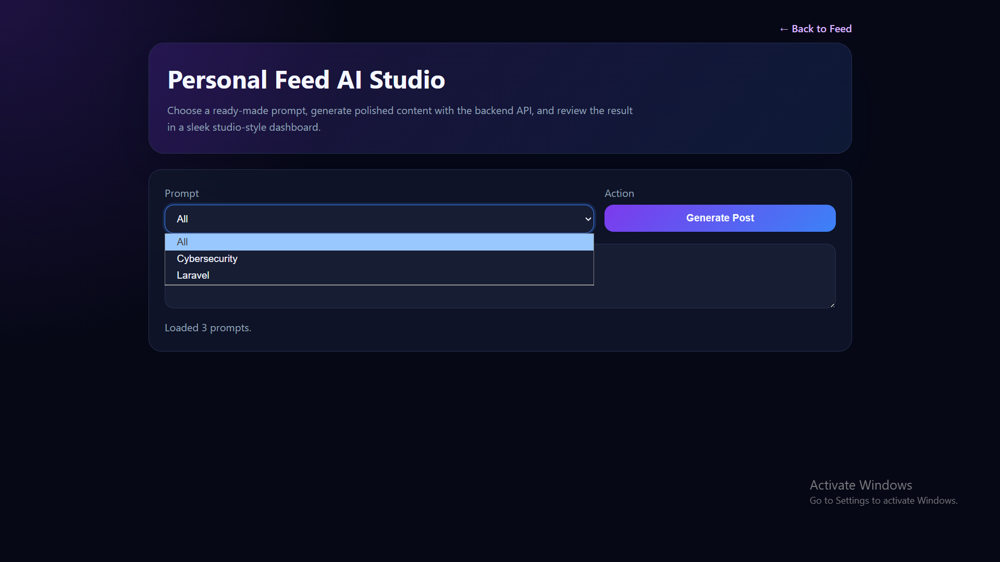
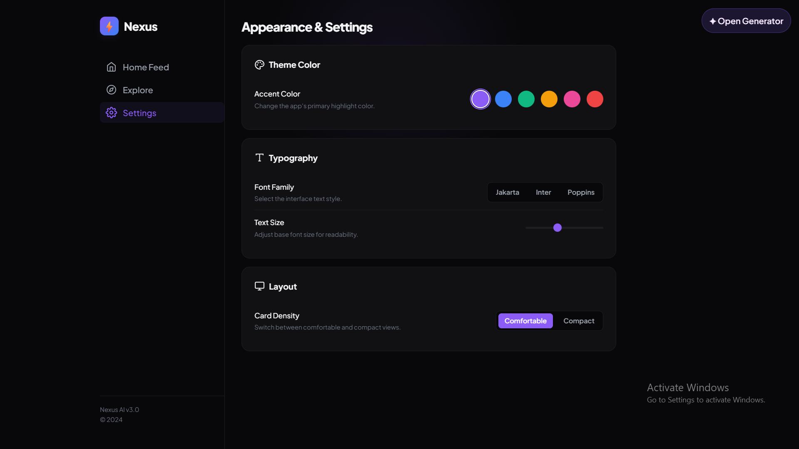

# Personal Feed

A FastAPI-based web application for browsing prompt-driven content ideas, generating posts, and exploring themed categories from a simple dashboard.

## Features

- FastAPI backend with health and generation endpoints
- Prompt discovery from the prompts directory
- Static dashboard and form-based UI
- Local persistence for generated posts in SQLite
- Simple configuration through environment variables

## Screenshots









## Run locally

1. Install dependencies:
   ```bash
   pip install -r requirements.txt
   ```
2. Create a local environment file:
   ```bash
   cp .env.example .env
   ```
3. Start the development server:
   ```bash
   uvicorn app.main:app --reload --host 0.0.0.0 --port 8000
   ```
4. Open http://localhost:8000/

## API

- GET /api/prompts
- POST /api/generate
- GET /health

Prompts are discovered automatically from the prompts directory.

## Configuration

The application uses environment variables such as:

- TOKEN: API token for the generation service
- MODEL: model identifier to use
- GENERATOR_LOG_DIR: optional log directory override
